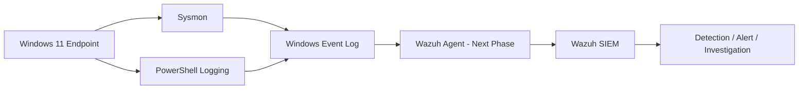

# Windows-Endpoint-Telemetry-SOC-Investigation-Lab
# SOC Home Lab — Windows Endpoint Telemetry

A hands-on blue-team lab focused on Windows endpoint visibility, Sysmon telemetry, PowerShell logging, and basic SOC investigation workflows.

> **Status:** Windows endpoint telemetry is complete. Wazuh SIEM integration is the next phase.
>
> **Privacy:** Screenshots in this repository have been cropped/redacted to remove local usernames, hostnames, and other environment-specific identifiers.

## What I Built

- Installed and validated Microsoft Sysmon on Windows 11.
- Loaded the SwiftOnSecurity Sysmon configuration to reduce low-value telemetry noise.
- Enabled PowerShell Script Block Logging (`Event ID 4104`).
- Validated key Sysmon telemetry:
  - `Event ID 1` — Process Create
  - `Event ID 3` — Network Connection
  - `Event ID 11` — File Create
  - `Event ID 22` — DNS Query
- Added a custom Sysmon FileCreate rule for controlled lab files.
- Performed a small SOC investigation by correlating DNS, network, and file-creation activity using the same `ProcessGuid` and `ProcessId`.

## Lab Architecture



## Environment

| Component | Configuration |
|---|---|
| Endpoint | Windows 11 |
| Endpoint telemetry | Microsoft Sysmon |
| Sysmon configuration | SwiftOnSecurity baseline + custom lab rule |
| PowerShell telemetry | Script Block Logging / Event ID 4104 |
| Current analysis interface | Windows Event Viewer / PowerShell |
| Planned SIEM | Wazuh |

## 1. Sysmon Installation and Validation

Sysmon was installed as a Windows service and verified as running.

```powershell
.\Sysmon64.exe -accepteula -i
Get-Service Sysmon64
```


## 2. Sysmon Configuration

The SwiftOnSecurity Sysmon configuration was loaded as a baseline:

```powershell
.\Sysmon64.exe -c .\sysmonconfig-export.xml
```

The configuration validated and updated successfully.


## 3. Process Creation — Sysmon Event ID 1

A controlled PowerShell child process was generated:

```powershell
powershell.exe -NoProfile -Command "Get-Process | Select-Object -First 5"
```

Sysmon captured the process creation, command line, integrity level, and parent-process information.


### Initial Triage

The event was treated as **suspicious and requiring further investigation**, not immediately malicious. PowerShell spawning another PowerShell process with command-line arguments can be legitimate, but it is also a pattern worth investigating in a SOC workflow.

## 4. PowerShell Script Block Logging — Event ID 4104

PowerShell Script Block Logging was enabled so the lab can record the content executed inside PowerShell rather than relying only on process creation metadata.

```powershell
New-Item -Path "HKLM:\SOFTWARE\Policies\Microsoft\Windows\PowerShell\ScriptBlockLogging" -Force
Set-ItemProperty `
  -Path "HKLM:\SOFTWARE\Policies\Microsoft\Windows\PowerShell\ScriptBlockLogging" `
  -Name EnableScriptBlockLogging `
  -Value 1
```

Validation test:

```powershell
& { "SOC4104TEST"; Get-Date }
```


## 5. DNS Query — Sysmon Event ID 22

A controlled DNS lookup was generated:

```powershell
Resolve-DnsName example.com
```

Sysmon recorded the querying process, queried domain, query status, and resolved IP addresses.


## 6. Network Connection — Sysmon Event ID 3

A controlled outbound HTTPS request was generated:

```powershell
Invoke-WebRequest https://example.com -Method Head
```

The resulting network event showed PowerShell establishing an outbound TCP connection to a resolved IP on port 443.


## 7. File Creation — Sysmon Event ID 11

A normal temporary `.txt` file was initially **not** captured by the loaded Sysmon configuration. This demonstrated an important telemetry concept:

> Missing telemetry does not necessarily mean an activity did not occur. Collection rules may intentionally filter low-value events.

To make controlled lab files observable without enabling all file-creation logging, a narrow custom rule was added inside the existing `FileCreate` include section:

```xml
<TargetFilename condition="contains">soc-lab-test-</TargetFilename>
```


After reloading the Sysmon configuration, a controlled test file was captured successfully:

```powershell
"Mini SOC Investigation" | Set-Content "$env:TEMP\soc-lab-test-final.txt"
```


## 8. SOC Investigation #001

The following controlled activity sequence was generated:

```powershell
Resolve-DnsName example.com
Invoke-WebRequest https://example.com -Method Head
"Mini SOC Investigation" | Set-Content "$env:TEMP\soc-lab-test-final.txt"
```

The events were correlated using the same Sysmon process identifiers.

```text
PowerShell.exe
   |
   +-- Event ID 22: DNS Query
   |      example.com
   |      -> 172.66.147.243 / 104.20.23.154
   |
   +-- Event ID 3: Network Connection
   |      -> 172.66.147.243:443
   |
   +-- Event ID 11: File Create
          -> soc-lab-test-final.txt
```

### Investigation Summary

> During a controlled SOC lab exercise, PowerShell activity was investigated using Sysmon telemetry. The process performed a DNS query for `example.com`, established an outbound HTTPS connection to one of the resolved IP addresses, and created a test file in the user's temporary directory. The events were correlated using the same Sysmon `ProcessGuid` and `ProcessId`. Because the activity was intentionally generated as part of an authorized lab exercise, it was classified as benign.

A more detailed write-up is available in [`docs/investigation-001.md`](docs/investigation-001.md).

## Key Lessons Learned

- Sysmon provides high-value Windows endpoint telemetry but should be tuned to manage noise.
- `Event ID 1` provides process and parent-process context.
- `Event ID 3` ties outbound network activity to a specific process.
- `Event ID 11` can reveal file creation activity when collection rules include it.
- `Event ID 22` provides process-aware DNS telemetry.
- PowerShell `Event ID 4104` provides visibility into executed script blocks.
- Suspicious behavior is not automatically malicious; context and corroborating evidence matter.
- `ProcessGuid` is useful for correlating events from the same process instance.
- Logging rules require a balance between visibility and noise.
- A missing event may be caused by collection policy rather than absence of the underlying activity.

## Repository Structure

```text
SOC-Home-Lab/
├── README.md
├── configs/
│   └── custom-filecreate-rule-snippet.xml
├── docs/
│   └── investigation-001.md
├── scripts/
│   ├── enable-powershell-scriptblock-logging.ps1
│   └── validate-telemetry.ps1
└── screenshots/
    ├── 01-sysmon-service-running.png
    ├── 02-sysmon-config-loaded.png
    ├── 03-event1-powershell-process-create.png
    ├── 04-custom-filecreate-rule.png
    ├── 05-event22-dns-query.png
    ├── 06-event11-file-create.png
    ├── 07-event3-network-connection.png
    └── 08-powershell-4104.png
```

## Next Steps

- [x] Install and validate Sysmon
- [x] Load a tuned Sysmon configuration
- [x] Enable PowerShell Script Block Logging
- [x] Validate process telemetry
- [x] Validate DNS telemetry
- [x] Validate network telemetry
- [x] Validate file-creation telemetry
- [x] Tune a custom Sysmon collection rule
- [x] Complete SOC Investigation #001
- [ ] Deploy Wazuh SIEM
- [ ] Install and enroll the Wazuh Windows agent
- [ ] Forward Sysmon and PowerShell logs to Wazuh
- [ ] Create custom SIEM detection rules
- [ ] Map detections to MITRE ATT&CK
- [ ] Create repeatable incident reports
- [ ] Integrate AI-assisted SOC triage

## References

- Microsoft Sysmon: https://learn.microsoft.com/sysinternals/downloads/sysmon
- SwiftOnSecurity Sysmon Config: https://github.com/SwiftOnSecurity/sysmon-config
- MITRE ATT&CK: https://attack.mitre.org/

---

**Purpose:** Educational blue-team / SOC practice in a controlled environment.
